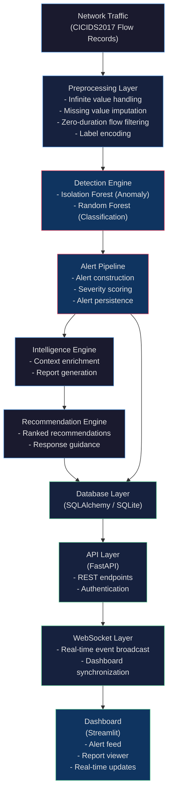
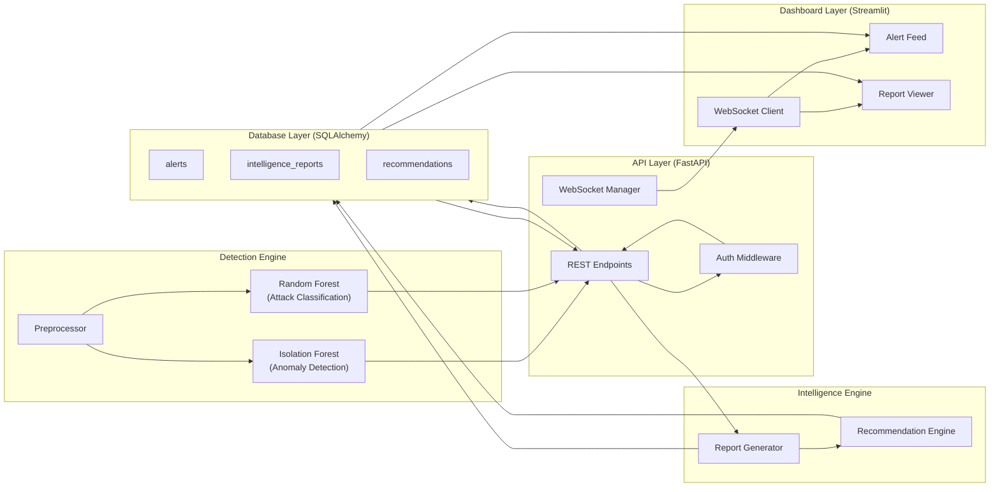
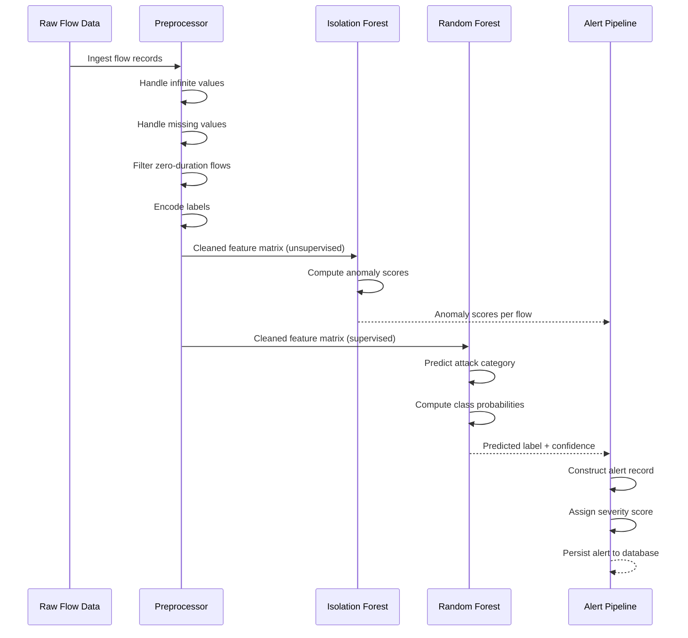
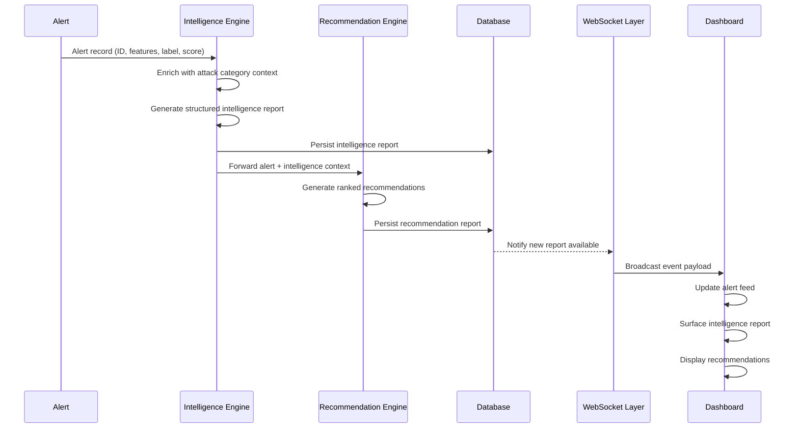
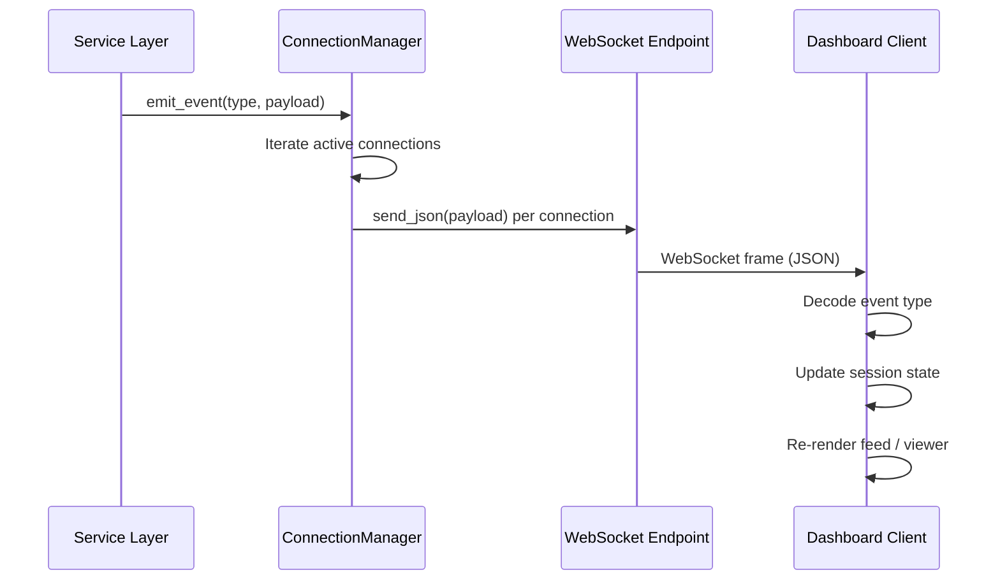

# BlackTrace

**AI-Assisted SOC Intelligence Platform for Network Intrusion Analysis**

---

## Table of Contents

- [Project Overview](#project-overview)
- [Scope and Design Philosophy](#scope-and-design-philosophy)
- [System Architecture](#system-architecture)
- [High-Level Component Architecture](#high-level-component-architecture)
- [Detection Pipeline](#detection-pipeline)
- [Intelligence Workflow](#intelligence-workflow)
- [Data Sources and Research References](#data-sources-and-research-references)
- [Repository Structure](#repository-structure)
- [Intelligence Reports](#intelligence-reports)
- [Real-Time Event Streaming](#real-time-event-streaming)
- [Security Model](#security-model)
- [Known Limitations](#known-limitations)
- [Project Wiki](#project-wiki)
- [Future Directions](#future-directions)
- [License](#license)

---

## Project Overview

BlackTrace is a Security Operations Center (SOC) intelligence platform that integrates unsupervised anomaly detection, supervised attack classification, and automated intelligence report generation over labeled network flow data. It is designed to demonstrate how a structured detection pipeline, backed by machine learning models trained on the CICIDS2017 dataset, can feed an intelligence workflow that produces actionable analyst output.

In a conventional SOC, the analyst workflow involves three stages: detection, triage, and response. Detection surfaces events. Triage determines whether an event is a credible threat. Response coordinates remediation. BlackTrace covers the detection and triage stages by automating the generation of intelligence reports and ranked recommendations tied to each detected alert, with a real-time dashboard providing the analyst-facing interface.

The problem BlackTrace addresses is not detection in isolation. Producing an alert is a solved problem in the research literature. The harder problem is what happens immediately after: what context is attached to the alert, how that context is structured for analyst consumption, and how the system assists the analyst in deciding whether to escalate. BlackTrace treats this post-detection workflow as a first-class design concern.

The platform was built for two purposes. The first is engineering: to demonstrate the integration of multiple components — preprocessing, model inference, API serving, persistence, WebSocket streaming, and a dashboard — into a coherent system. The second is educational: to serve as a reference implementation for engineers and students studying applied machine learning in security contexts, particularly those working with the CICIDS2017 benchmark dataset.

---

## Scope and Design Philosophy

BlackTrace is an educational and engineering demonstration platform. It is not a production Security Information and Event Management (SIEM) system, and it does not claim feature parity with platforms such as Splunk, Elastic Security, or IBM QRadar.

**Educational Purpose**

The project is explicitly designed to be studied. Every component boundary is intentional. The preprocessing workflow is transparent and documented. The model selection decisions — Isolation Forest for unsupervised anomaly detection, Random Forest for supervised classification — are made with the CICIDS2017 benchmark in mind, not with the expectation that these models transfer cleanly to arbitrary enterprise environments. Engineering students working in security operations, data science, or applied ML should find this codebase useful as a structured reference rather than as production tooling.

**Engineering Focus**

The architecture prioritizes clarity over performance optimization. Component responsibilities are separated to make the system easy to reason about. The detection engine does not know about the API layer. The intelligence engine does not know about the dashboard. Communication between layers flows through well-defined interfaces. This is deliberate: in an educational context, a system that is easy to understand is more valuable than one that is aggressively optimized.

**Non-Production Limitations**

SQLite is used as the persistence backend. This is adequate for demonstration purposes and removes the operational burden of managing a database server. It is not appropriate for concurrent write-heavy workloads or for deployments where the alert volume exceeds what SQLite can handle without locking. The security model implements API key authentication over the FastAPI layer but does not implement role-based access control, audit logging, or the full authentication surface expected of production security tooling. These are known gaps, documented explicitly in the Known Limitations section.

**Architectural Goals**

The architecture is designed so that any single component can be replaced without requiring changes to adjacent components. The SQLite backend can be replaced with PostgreSQL by changing the SQLAlchemy connection string and adjusting the session configuration. The Streamlit dashboard can be replaced with a React frontend by consuming the same FastAPI endpoints and WebSocket events. The detection models can be swapped for different estimators by conforming to the interface expected by the detection engine. These substitutions are the intended migration path toward production deployment.

---

## System Architecture

The following diagram represents the end-to-end data flow through the BlackTrace platform, from raw network flow input through to analyst-facing output.



---

## High-Level Component Architecture

The following diagram shows how the major runtime components interact and where the system's primary data flows are established.



---

## Detection Pipeline

### CICIDS2017 Dataset

The detection pipeline is trained and evaluated on the [CICIDS2017 dataset](https://www.unb.ca/cic/datasets/ids-2017.html), produced by the Canadian Institute for Cybersecurity. CICIDS2017 contains labeled network flow records generated using [CICFlowMeter](https://github.com/ahlashkari/CICFlowMeter) from a controlled network environment. The dataset covers multiple attack categories including DoS, DDoS, Brute Force, Web Attacks, Infiltration, Bot, and Portscan traffic, alongside benign baseline flows.

Each flow record contains 78 features representing statistical properties of the network flow: byte counts, packet lengths, inter-arrival times, flag counts, and others. The label column identifies whether the flow is benign or belongs to a specific attack category.

### Preprocessing Workflow

Raw CICIDS2017 CSV files require preprocessing before they are suitable for model training or inference. The preprocessing layer handles the following:

**Infinite values:** Several flow features can produce infinite values when computed over zero-duration or near-zero-duration connections. These are replaced with large finite values determined by the feature's non-infinite distribution.

**Missing values:** Flows with missing feature values are either imputed or dropped depending on the missingness pattern. Systematic missingness in a flow record typically indicates a malformed capture and results in row exclusion.

**Zero-duration flows:** Flows with a duration of zero seconds are a known artifact of the CICFlowMeter feature extraction process. Depending on the feature, zero-duration flows can introduce numerical instability (division by zero in rate calculations). These are filtered or handled explicitly before model input.

**Label encoding:** The string attack category labels are integer-encoded for supervised model training. The encoding scheme is documented in the project Wiki.

### Anomaly Detection

Isolation Forest is applied to the preprocessed feature matrix without reference to labels. It constructs an ensemble of random isolation trees and scores each flow by the average path length required to isolate it. Flows that are isolated by shorter paths receive higher anomaly scores. The contamination parameter is set based on the known class imbalance in CICIDS2017.

Isolation Forest is well-suited to this use case because it does not require labeled attack examples during training. It is sensitive to distributional outliers, which in network flow data often corresponds to attack traffic that differs statistically from the benign baseline.

### Attack Classification

Random Forest is applied as a supervised classifier using the labeled CICIDS2017 records. The model is trained to distinguish between benign traffic and the attack categories present in the dataset. Classification output produces both a predicted label and a per-class probability vector, which is used in alert severity scoring.

The combination of Isolation Forest (unsupervised) and Random Forest (supervised) is intentional. The anomaly detector surfaces traffic that deviates from the baseline without requiring a label. The classifier provides a specific attack category assignment for flows that cross the anomaly threshold. In practice, both signals are surfaced to the analyst rather than one overriding the other.

### Detection Sequence



---

## Intelligence Workflow

Each alert generated by the detection pipeline triggers an intelligence workflow. The intelligence engine enriches the raw alert with contextual information, produces a structured report, and hands off to the recommendation engine, which generates response guidance ranked by relevance and feasibility.

The intelligence report is stored in the database and linked to the originating alert by a foreign key relationship. The recommendation report is stored separately and linked to both the alert and the intelligence report. This structure allows analysts to navigate from an alert to its intelligence report to its recommendations without losing referential context.



---

## Data Sources and Research References

**Primary Dataset**

- [CICIDS2017 — Intrusion Detection Evaluation Dataset](https://www.unb.ca/cic/datasets/ids-2017.html)
  Produced by the [Canadian Institute for Cybersecurity (CIC)](https://www.unb.ca/cic/), University of New Brunswick. The dataset contains labeled network flow records generated in a controlled testbed environment and covers seven attack categories alongside benign baseline traffic.

**Feature Extraction Tool**

- [CICFlowMeter](https://github.com/ahlashkari/CICFlowMeter)
  The tool used to generate bidirectional flow statistics from raw packet captures. Understanding its feature calculation methodology is necessary to interpret several preprocessing decisions documented in the Wiki.

**Background Reading**

- [NIST SP 800-61r2 — Computer Security Incident Handling Guide](https://csrc.nist.gov/publications/detail/sp/800-61/rev-2/final)
  Provides the incident response framework context within which a SOC intelligence platform operates.

- [MITRE ATT&CK Framework](https://attack.mitre.org/)
  A reference for mapping detected attack categories to adversary tactics and techniques. Future integration is noted under Future Directions.

**Research Paper**

Sharafaldin, I., Lashkari, A.H., Ghorbani, A.A. (2018).
*Toward Generating a New Intrusion Detection Dataset and Intrusion Traffic Characterization.*
Proceedings of the 4th International Conference on Information Systems Security and Privacy (ICISSP 2018).

> This paper describes the methodology used to construct CICIDS2017, including the testbed design, the traffic generation process, and the feature extraction approach. Engineers working with CICIDS2017 should read this paper before making preprocessing decisions, as several dataset artifacts (zero-duration flows, feature scaling issues) are explained by the data generation methodology.

[Full paper available via ICISSP 2018 proceedings](https://www.scitepress.org/papers/2018/66398/66398.pdf)

---

## Repository Structure

```
BlackTrace/
├── app/
│   ├── main.py                    # FastAPI application entry point
│   ├── config.py                  # Environment and configuration management
│   ├── dependencies.py            # Dependency injection (auth, db session)
│   ├── models/
│   │   ├── alert.py               # SQLAlchemy Alert model
│   │   ├── intelligence.py        # SQLAlchemy IntelligenceReport model
│   │   └── recommendation.py      # SQLAlchemy RecommendationReport model
│   ├── schemas/
│   │   ├── alert.py               # Pydantic request/response schemas
│   │   ├── intelligence.py
│   │   └── recommendation.py
│   ├── routers/
│   │   ├── alerts.py              # Alert endpoints
│   │   ├── intelligence.py        # Intelligence report endpoints
│   │   ├── recommendations.py     # Recommendation endpoints
│   │   └── websocket.py           # WebSocket endpoint
│   ├── services/
│   │   ├── alert_service.py       # Alert business logic
│   │   ├── intelligence_service.py
│   │   └── recommendation_service.py
│   └── database.py                # SQLAlchemy engine and session factory
│
├── detection_engine/
│   ├── __init__.py
│   ├── preprocessor.py            # Data cleaning and feature preparation
│   ├── anomaly_detector.py        # Isolation Forest wrapper
│   ├── classifier.py              # Random Forest wrapper
│   ├── pipeline.py                # End-to-end detection pipeline
│   └── models/
│       ├── isolation_forest.pkl   # Serialized Isolation Forest model
│       └── random_forest.pkl      # Serialized Random Forest model
│
├── intelligence/
│   ├── __init__.py
│   ├── report_generator.py        # Intelligence report construction
│   └── recommendation_engine.py  # Recommendation ranking logic
│
├── dashboard/
│   ├── app.py                     # Streamlit dashboard entry point
│   ├── components/
│   │   ├── alert_feed.py          # Alert feed component
│   │   ├── report_viewer.py       # Intelligence report viewer
│   │   └── websocket_client.py    # WebSocket listener
│   └── utils/
│       └── api_client.py          # FastAPI client for dashboard
│
├── tests/
│   ├── test_preprocessor.py
│   ├── test_anomaly_detector.py
│   ├── test_classifier.py
│   ├── test_alert_service.py
│   ├── test_intelligence_service.py
│   └── test_api.py
│
├── data/
│   └── cicids2017/                # Place raw CICIDS2017 CSV files here
│
├── notebooks/
│   ├── eda.ipynb                  # Exploratory data analysis
│   ├── model_training.ipynb       # Model training and evaluation
│   └── preprocessing_audit.ipynb  # Preprocessing decision validation
│
├── requirements.txt
├── .env.example
├── alembic.ini                    # Database migration configuration
├── alembic/
│   └── versions/                  # Migration scripts
└── README.md
```

---

## Intelligence Reports

Each alert produced by the detection pipeline is associated with an intelligence report generated by the intelligence engine. The report is a structured document that captures the following information:

**Alert linkage.** The report is linked to its originating alert by a foreign key. This relationship allows the system to retrieve the alert's raw feature values, anomaly score, and classifier output when rendering the report, without duplicating that information in the report record itself.

**Attack category context.** The report includes a description of the detected attack category, including its known behavioral characteristics as documented in the CICIDS2017 literature. This is static context keyed by the classifier's predicted label.

**Feature attribution.** For alerts where the classifier confidence is high, the report includes the top features that contributed to the classification decision. This provides the analyst with a basis for manual validation rather than treating the model output as opaque.

**Severity assessment.** The report includes a severity rating derived from the classifier confidence, the anomaly score, and the attack category. The severity rating is not a single scalar but is broken down by dimension so analysts can understand what is driving it.

**Report retrieval.** Intelligence reports are accessible via the `/intelligence/{alert_id}` endpoint. The API returns the full report body alongside the originating alert record. The dashboard report viewer renders this output and links it to the associated recommendations.

---

## Real-Time Event Streaming

BlackTrace uses WebSockets to push events from the API layer to the Streamlit dashboard without requiring the dashboard to poll. This is relevant because alert volumes can spike rapidly during simulated attack scenarios, and polling introduces latency that degrades the analyst experience.

**WebSocket architecture.** The FastAPI application maintains a `ConnectionManager` that tracks all active WebSocket connections. When a new alert, intelligence report, or recommendation is persisted, the relevant service emits an event payload to the `ConnectionManager`, which broadcasts it to all connected clients.

**Event broadcasting.** Events are JSON-encoded payloads containing an event type, a timestamp, and a summary of the new record. The dashboard client receives these payloads and updates its state without requiring a full page reload.

**Dashboard synchronization.** The Streamlit dashboard uses a background thread to maintain the WebSocket connection and a session state variable to accumulate incoming events. The alert feed and report viewer components re-render when new events arrive.



---

## Security Model

The BlackTrace API implements token-based authentication via API keys. All non-public endpoints require a valid API key passed in the `X-API-Key` request header. The authentication middleware validates the key against a configured value loaded from the environment at startup.

**Protected endpoints.** All alert, intelligence, and recommendation endpoints are protected. The WebSocket endpoint requires the API key as a query parameter during the handshake. Unauthenticated requests return HTTP 403.

**Intended security posture.** The authentication model is appropriate for a local or isolated demonstration deployment. It is not appropriate for public-facing deployments. The following are explicitly absent from the current implementation: user management, role-based access control, token rotation, audit logging, TLS termination at the application layer, and rate limiting. Any deployment on a network boundary should be placed behind a reverse proxy that handles TLS and should treat the API key as a shared secret with the same operational care as a service account credential.

**Environment variable handling.** Secrets are loaded from environment variables and not committed to the repository. The `.env.example` file documents required variables without providing values. This is the minimum acceptable secret management practice for a project of this scope.

---

## Known Limitations

These limitations are documented as an engineering retrospective rather than a disclaimer. Understanding them is necessary for any engineer who intends to extend the platform or evaluate its applicability to a different context.

**Educational scope.** BlackTrace is not a production system. It has not been evaluated against live network traffic, has not been subjected to adversarial evasion testing, and does not implement the full operational surface of a SIEM. Using it as the primary detection mechanism in any environment where detection failures have real consequences would be a design error.

**SQLite limitations.** SQLite does not support concurrent writes without locking. Under alert volumes typical of even moderate network environments, write contention will degrade performance. The ORM layer is abstracted through SQLAlchemy, which means migration to PostgreSQL requires minimal code change, but that migration has not been tested end-to-end and is left as an exercise for engineers extending the platform.

**CICIDS2017 dependency.** The detection models are trained exclusively on CICIDS2017 data generated in a controlled testbed environment. The network conditions, traffic patterns, and protocol distributions in CICIDS2017 do not match those of arbitrary enterprise environments. Models trained on this dataset should not be expected to generalize without retraining on environment-specific data.

**Anomaly detection limitations.** Isolation Forest is sensitive to the contamination parameter. If the assumed contamination rate does not match the actual proportion of anomalous traffic in the input, the model will produce poorly calibrated scores. In CICIDS2017, the class distribution is known, which makes parameterization tractable. In real environments, it is not.

**Isolation Forest evaluation findings.** During model evaluation on the CICIDS2017 test split, Isolation Forest demonstrated high sensitivity to benign traffic that contains statistical outliers due to application behavior rather than attack patterns. Several legitimate high-bandwidth flows scored above the anomaly threshold, producing false positives. This is an inherent property of unsupervised anomaly detection applied to heterogeneous traffic, and it is one reason the supervised Random Forest classifier is included as a second signal rather than relying on the anomaly detector alone.

**Label distribution.** CICIDS2017 is heavily imbalanced. Benign traffic accounts for the majority of records. The Random Forest classifier is trained with class weighting to mitigate this, but the resulting model may underperform on minority attack classes. The model training notebook documents per-class precision, recall, and F1 scores.

**No streaming inference.** The current implementation processes flow records in batch. It does not support streaming inference over live network captures. Integration with tools such as Zeek or Suricata for live flow export is a future direction, not a current capability.

---

## Project Wiki

The [BlackTrace Wiki](https://github.com/varma1221/BlackTrace/wiki) contains implementation-level documentation that is intentionally kept separate from this README.

This README provides the system-level overview: what BlackTrace is, how the components fit together, and what the platform does and does not do. The Wiki provides the implementation-level documentation: why specific decisions were made, how they were evaluated, and what the development process looked like.

Engineers extending or studying the platform should treat the Wiki as the primary reference for the following:

**Preprocessing decisions.** The rationale for how infinite values are handled, which zero-duration flow filtering strategy was selected and why, and the label encoding scheme are documented in the Wiki. These are not arbitrary implementation choices, and understanding them is necessary before modifying the preprocessing layer.

**Model evaluation.** The full evaluation results for both the Isolation Forest and Random Forest models, including confusion matrices, per-class metrics, and notes on failure modes observed during evaluation, are in the Wiki. The README summarizes limitations; the Wiki explains them with data.

**Design notes.** Architecture decisions that were considered and rejected are documented in the Wiki alongside the decisions that were adopted. This includes alternative persistence backends, alternative dashboard frameworks, and the rationale for using two models rather than one.

**Development history.** The Wiki tracks significant changes to the platform across development phases. This is useful for understanding why the current implementation looks the way it does and where it has diverged from the original design.

If this README raises a question about implementation, the answer is likely in the Wiki. If it is not, that is a documentation gap worth filing as an issue.

---

## Future Directions

The following are realistic enhancements grounded in the current architecture. They are not commitments.

**PostgreSQL migration.** Replacing SQLite with PostgreSQL would address the write contention limitations and enable concurrent deployments. The SQLAlchemy abstraction makes this straightforward at the ORM level; the migration would require environment configuration, schema migration testing, and connection pool tuning.

**Live flow ingestion.** Integrating with Zeek or Suricata to consume live network flow records would allow BlackTrace to operate on current traffic rather than historical batch data. This requires a streaming inference pipeline rather than the current batch processor, and would involve significant changes to the detection engine interface.

**MITRE ATT&CK mapping.** Mapping the detected attack categories to MITRE ATT&CK tactics and techniques would make the intelligence reports more actionable for analysts who use ATT&CK-aligned playbooks. This is a relatively contained addition to the intelligence engine, as the mapping can be implemented as a static lookup keyed by classifier output label.

**User authentication and RBAC.** Replacing the shared API key with a proper user authentication system, including role-based access control and audit logging, is a prerequisite for any deployment involving multiple analysts. This would require adding a user management layer to the API and is a substantial scope addition.

**Alert correlation.** The current system treats each alert as an independent event. Alert correlation — grouping related alerts into incidents, tracking attacker behavior across multiple flows — is a significant capability gap relative to production SIEM systems. Implementing a basic correlation engine using temporal and source-IP clustering would be a meaningful extension.

**Model retraining pipeline.** The current models are trained offline and serialized as pickle files. A retraining pipeline that allows models to be updated as new labeled data becomes available, without restarting the API server, would improve operational usability.

**Expanded dataset support.** CICIDS2017 is not the only labeled network intrusion dataset. Supporting additional datasets — CICIDS2018, CIC-DDoS2019, or others from the Canadian Institute for Cybersecurity — would allow the platform to evaluate how models trained on one dataset perform when evaluated on another, which is a question with practical relevance to deployment in real environments.

---

## License

BlackTrace is released under the [MIT License](LICENSE).

The CICIDS2017 dataset is subject to the terms of use established by the [Canadian Institute for Cybersecurity](https://www.unb.ca/cic/datasets/ids-2017.html). Users of BlackTrace who include the dataset in their local environment are responsible for compliance with those terms.

---

*For implementation details, preprocessing decisions, model evaluation results, and design notes, refer to the [BlackTrace Wiki](https://github.com/varma1221/BlackTrace/wiki).*
